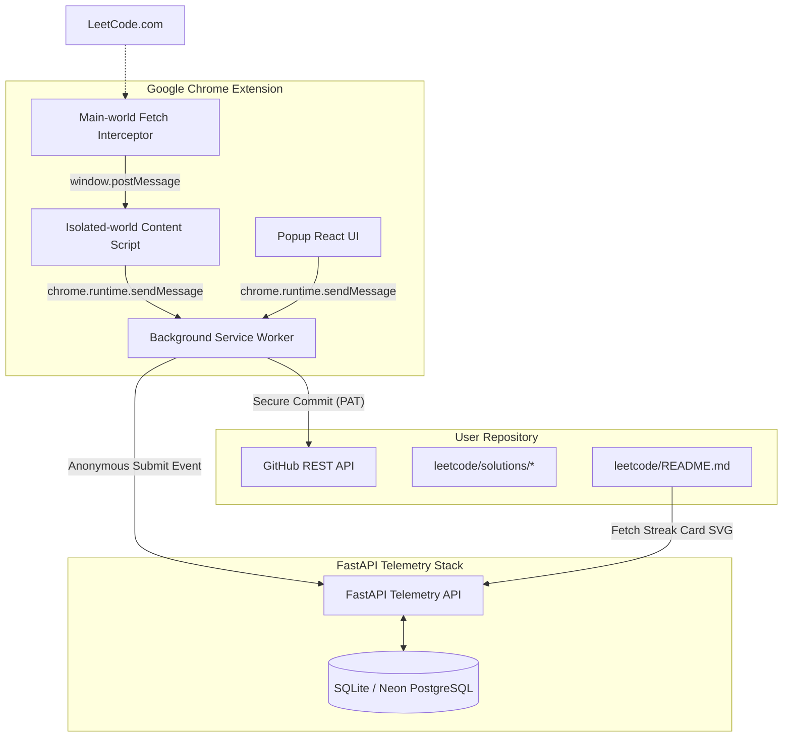

# AlgoLens System Architecture 📐

This document outlines the end-to-end architecture, monorepo components, data flow, and runtime event sequence diagrams of **AlgoLens**.

---

## 🏗️ System Components

AlgoLens is structured as a decoupled monorepo composed of three primary functional zones:



| Component | Responsibility | Tech Stack |
| :--- | :--- | :--- |
| **Main-world Interceptor** | Injected directly into the `leetcode.com` document to override the global fetch object and capture GraphQL/REST payload requests (specifically `/submit/` payloads containing the Monaco editor code). | Vanilla JavaScript (TypeScript compiled) |
| **Isolated-world Content Script** | Tracks tab active/idle time state, receives submission payloads from the interceptor, and coordinates communication with the service worker. | TypeScript |
| **Background Worker** | Acts as the execution hub. Manages Chrome storage state, securely triggers commits/PRs directly to the GitHub REST API, and dispatches telemetry logs to the backend. | TypeScript (MV3 Service Worker) |
| **React Popup & Onboarding** | Renders settings, local dashboards, repository setup controls, and the historical bulk-import wizard. | React + TypeScript + Vanilla CSS |
| **FastAPI Backend Server** | Processes anonymous submission telemetry, computes percentiles, and dynamically generates SVG stats cards. | Python + FastAPI + Uvicorn |
| **Databases** | Stores problem metadata and community submission time intervals. Fallback to local SQLite for development, Neon PostgreSQL for production. | SQLite / NeonDB (PostgreSQL) |

---

## 🔄 Sequence Diagrams

### 1. Real-Time Submission Sync Flow

When a user completes and submits a LeetCode problem, the execution flow is processed natively across the interceptor, content script, background service worker, and backend API:

```mermaid
sequenceDiagram
    autonumber
    actor User as User (leetcode.com)
    participant Page as Page DOM / Monaco Editor
    participant Int as Fetch Interceptor (MAIN World)
    participant Content as Content Script (ISOLATED World)
    participant Background as Service Worker (Background)
    participant GitHub as GitHub REST API
    participant Backend as FastAPI Telemetry API

    User->>Page: Type code & click "Submit"
    Int->>Int: Intercept post to /submit/ & extract typed_code
    Int-->>Content: window.postMessage(typed_code)
    LeetCode->>Page: Return submission status (Accepted)
    Content->>Content: Verify accepted state & finalize focus timer
    Content-->>Background: chrome.runtime.sendMessage(SubmissionPayload)
    
    rect rgb(28, 30, 36)
        Note over Background: Retrieve GitHub PAT & configuration from Storage
        par Background to GitHub
            Background->>GitHub: Create or Update problem code file (solutions/problem-slug.py)
            Background->>GitHub: Create/Update stats JSON metadata (data/problem-slug.json)
            Background->>GitHub: Fetch & Update repository index README.md
        and Background to Telemetry
            Background->>Backend: POST /api/submission-event (Anonymized analytics)
        end
    end
    
    GitHub-->>Background: Push Complete (SHA returned)
    Backend-->>Background: Analytics Recorded
    Background-->>User: Show desktop Notification ("Success: Solution pushed!")
```



---

### 2. Historical Bulk-Sync Flow

For users with many previously solved problems, the **Bulk Sync** wizard page fetches, deduplicates, filters, and commits historical solutions sequentially without requiring manual resubmissions:

```mermaid
sequenceDiagram
    autonumber
    actor User as User (Popup UI)
    participant Popup as React Popup UI
    participant LeetCode as LeetCode GraphQL API
    participant Background as Service Worker (Background)
    participant GitHub as GitHub REST API

    User->>Popup: Open "Bulk Sync" tab & click "Scan Problems"
    
    rect rgb(28, 30, 36)
        Note over Popup: Query LeetCode GraphQL using active tab cookies
        loop Paginated Submissions Scan
            Popup->>LeetCode: Query submissionList(offset, limit)
            LeetCode-->>Popup: Return submissions page (status, lang, title, slug)
        end
        Note over Popup: Filter for "Accepted" status
        Note over Popup: Group by (titleSlug, lang) and select most recent
    end

    Popup->>GitHub: Fetch repository directory listing
    GitHub-->>Popup: Return existing files (e.g. solutions/*)
    Note over Popup: Exclude problems where solution file already exists
    
    Popup-->>User: Display list of pending solves (e.g., "12 solutions to sync")
    User->>Popup: Click "Start Sync"

    rect rgb(28, 30, 36)
        loop For each unsynced submission (with 1.5s delay to avoid rate limits)
            Popup->>LeetCode: Query submissionDetails(submissionId)
            LeetCode-->>Popup: Return source code & execution stats
            Popup-->>Background: chrome.runtime.sendMessage(SyncRequest)
            Background->>GitHub: Commit solution file, metadata JSON, and update index README
            GitHub-->>Background: Commit confirmed
            Background-->>Popup: Sync success response
            Popup->>Popup: Increment progress bar & update status table
        end
    end

    Popup-->>User: Display "Bulk Sync Completed!"
```



---

## 🛡️ Privacy-Preserving Data Architecture & Separation of Concerns

AlgoLens uses a decentralized system design that isolates user-identifiable data on the client side. This design prevents the server backend from becoming a target for database breaches or handling sensitive authentication credentials (like GitHub PATs).

### 1. Client-Side State Generation (No User Accounts on Backend)
* **Decentralized Data Storage**: All details about which questions you solved, your attempts, streaks, and personal configurations are saved locally in the browser’s `chrome.storage.local` sandbox.
* **Direct-to-GitHub Commits**: When a solution is pushed, or when the README index table is updated, the Chrome Extension builds the Markdown documents entirely client-side and commits them directly to GitHub’s REST API. The backend server never knows what solutions exist in your repository.

### 2. Stateless SVG Rendering via Query Parameters
To display dynamic profile cards on your GitHub README, the backend’s `GET /api/svg/stats` endpoint uses a **stateless, parameter-driven rendering strategy**:
* **URL Parameter Binding**: Instead of querying a backend database to fetch your solved counts, the extension generates a Markdown image tag containing your actual statistics directly in the request query parameters:
  ```markdown
  
  ```
* **Instant Dynamic Compilation**: When GitHub's camo proxy requests the card image, the FastAPI backend reads these numbers directly from the query parameters, binds them to the SVG template, and returns the image. No database lookups or user authentication are required to fetch your specific statistics.

### 3. Aggregated Community Benchmarks
* **Database Purpose**: The database on the backend server only stores anonymized telemetry payloads (solve duration, attempts, language, problem slug).
* **Comparative Queries**: When rendering the card, the server performs a quick, indexed query on the `problems` table to retrieve the community's global averages (e.g., average solve duration for `two-sum`). It overlays these benchmarks onto your custom card so you can compare your speed against the community in real-time.

---

## 🔒 Security & Privacy Model

1. **Token Seclusion**: Your GitHub Personal Access Token (PAT) is stored exclusively in `chrome.storage.local`. It is only read inside the Extension's Background Service Worker and is passed directly to the `api.github.com` endpoints via secure HTTP headers. It is **never** sent to, processed by, or cached in the AlgoLens Telemetry backend database.
2. **Anonymized Telemetry**: The event logs sent to the FastAPI server (`POST /api/submission-event`) contain no profile IDs, usernames, repository strings, or IP-linked identifiers. They consist solely of:
   - Problem Slug (e.g., `two-sum`)
   - Submission Language (e.g., `python`)
   - Solve Duration in seconds
   - Attempts count
   - Difficulty level
